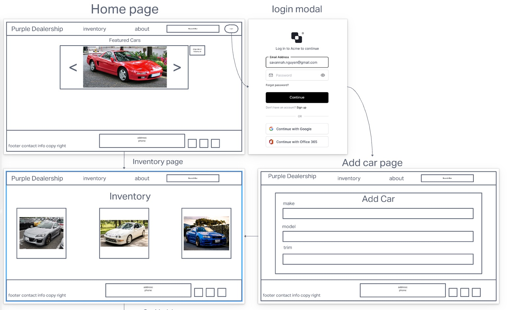
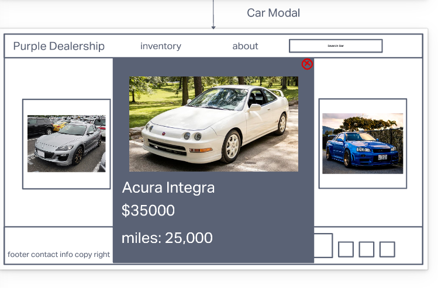

# Purple Dealership

## Description

Our project will be call the purple dealership. This will be a store front website for a car dealership. A customer will be able to come to the site to see a the dealership inventory. The customer will also be able to click on the car to get more information. The dealership will be able to login and be authenticated. Then the dealership will be able to CRUD the inventory. We will make an API request to a third party to get cars information.

## User Stories

1. As a consumer, I want to see an inventory of the cars

       images of the cars are large and easy to see 
       carousel style presentation
       present detailed car information 

2. As a consumer, I want to easily navigate the website

       nice, big buttons
       obvious link locations

3. As a client, I want to add vehicles to my homepage

       easily add new cars to the homepage
       updates the car info without extra effort
       an option to upload images

4. As a client, I want to have a secure login

       use an authorization/authentication protocol to verify employees
       simple to use interface

5. As a client, I want the consumer to easily contact the dealership to inquire for more info

       an obvious 'contact us' location
       links to send an email
       phone provided

6. As a consumer, I want to easily be able to contact the dealership

       to schedule an appointment to view the car
       to inquire more information

## Wireframing

Wireframe #1

wireframe #2

UML

## Schema

      const carSchema = new Schema({
      make: { type: String, required: true },
      model: { type: String, required: true },
      year: { type: Number, required: true },
      car_img: { type: URL, required: false },
      cylinders: { type: Number, required: false },
      highway_mpg: { type: Number, required: false },
      city_mpg: { type: Number, required: false },
      combination_mpg: { type: Number, required: false },
      drive: { type: String, required: false },
      transmission: { type: String, required: false },
      class: { type: String, required: false },
      displacement: { type: Number, required: false },
      fuel_type: { type: String, required: false },
    });

## Team Members

- David Suy
- Carlos Herrera
- Jefferey Smith
